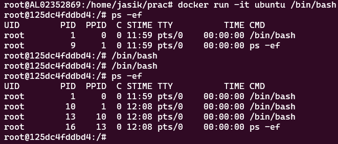
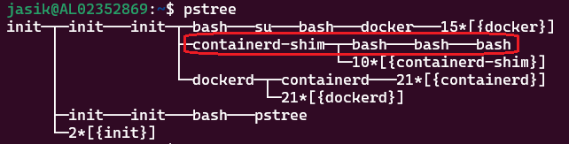
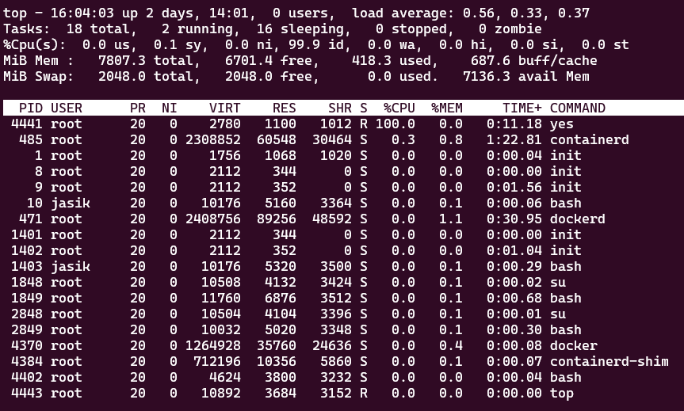
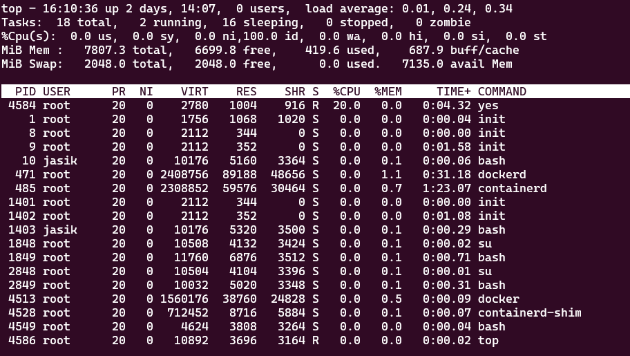

---

marp: true
theme: gaia
paginate: true

---

### Docker

 - 어플리케이션을 컨테이너 환경으로 개발 및 배포하도록 해주는 플랫폼
 - 어플리케이션, 종속성, 설정 등을 컨테이너에 패키징한다.
 - 손쉽게 여러 서버에 동일한 환경을 구성할 수 있고, 하나의 서버에 전혀 다른 환경을 가진 여러 컨테이너를 띄울 수도 있다.

---

 ### 컨테이너
 
 - 격리된 자원을 가진 하나 이상의 프로세스 세트
 - 하나의 커널 위에 여러개의 격리된 유저 공간 인스턴스들이 존재하게 된다.
 - OS의 격리 기술들을 활용해 컨테이너를 생성할 수 있다.

 ---

### OS 수준 격리

리눅스 커널 기능 사용

- chroot
- namespace
- cgroups
 
---

### chroot

프로세스의 루트 디렉토리를 변경한다.


---

### Namespace

네임스페이스는 다른 프로세스들은 보지 못하는 커널 자원을 특정 프로세스 묶음이 볼 수 있게 해주는 리눅스 커널 기능이다.

네임스페이스 종류
 - Mount
 - PID
 - Network
 - Inter-process Communication (IPC)
 - UTS
 - UID
 - cgroup
 - Time

---

### PID Namespace

- 부모 PID namespace에서 자식 namespace를 포함한 모든 프로세스들은 일반적인 프로세스 트리를 이룬다.
- 자식 PID namespace 내에서는 해당 네임스페이스 밖의 프로세스들이 보이지 않으며, 자식 PID namespace 내 최상위 프로세스의 PID는 자식 PID namespace 내에서는 1이 된다.


---

### PID Namespace
 - ubuntu 이미지로 상호작용 모드로 컨테이너 실행 후 /bin/bash 실행.
 - 이후 컨테이너 내에서 bash 두개 더 실행.
 - 프로세스 목록 출력 결과 4개의 프로세스만 보인다.



---

### PID Namespace

컨테이너 밖에서 프로세스 트리를 출력하면 실제로 실행중인 모든 프로세스가 보인다.



---

### Cgroup
Control Group (cgroup) 은 프로세스에게 하드웨어 리소스를 그룹으로 묶어 제한할 수 있는 기술이다.

여러 컨테이너가 하나의 커널을 공유하는 환경이므로 컨테이너별로 자원을 제한하여 특정 컨테이너의 자원 독점을 막을 수 있다.

`docker run -it --cpus="1.5" ubuntu /bin/bash`

cpu가 2개인 경우 위와 같이 cpus 옵션을 주어 우분투 컨테이너가 최대 1.5개의 cpu만 사용할 수 있도록 제한할 수 있다.

--cpus 옵션을 주는 것은 --cpu-period 옵션과 --cpu-quota 옵션을 함께 주는 것과 같다. 그러나 편의를 위해 --cpus 옵션 사용을 권장한다.

https://docs.docker.com/config/containers/resource_constraints/#cpu

---

 - cpu 제한 없이 컨테이너 실행
`docker run -it --name ubuntu_test ubuntu /bin/bash`

 - 컨테이너에서 `yes > /dev/null` 실행

 - host에서 top 결과. 컨테이너의 yes 프로세스가 CPU 한개를 100% 점유


---

 - cpu 를 0.5만 사용하도록 제한하여 컨테이너 실행
`docker run -it --name ubuntu_test --cpus ".5" ubuntu /bin/bash`

 - host에서 top 결과. 컨테이너의 yes 프로세스가 cpu를 100% 점유하지 못한다.


---

 - 컨테이너의 자원을 제한하지 않으면 특정 컨테이너의 자원 점유가 해당 컨테이너 밖으로도 영향을 미칠 수 있다.
 - 서비스의 중요한 역할을 담당하는 컨테이너에 충분하지 않은 자원이 할당된 경우 전체 시스템 자원은 부족하지 않은데, 해당 컨테이너 내에서 자원이 부족하여 서비스에 문제가 발생할 수 있다.

---

  ### 컨테이너를 사용하는 이유


 - 서비스에 필요한 OS, 라이브러리, 어플리케이션을 컨테이너로 묶을 수 있다
 - 게스트 OS까지 포함하여 가상화하는 Virtual Machine (VM)에 비해 가볍다


 ---

 ### Docker 구조
 - 도커 호스트 서버에 도커 데몬이 실행중 (dockerd)
 - 클라이언트의 명령은 REST API로 서버에 요청되어 서버에서 수행된다.


 ---

### Docker 구조

1) Docker CLI 명령을 Docker Client가 Rest API로 변환하여 dockerd에게 요청
2) dockerd는 새 컨테이너를 생성해야하는 경우 gRPC로 containerd와 통신
3) containerd는 Docker 이미지를 가져와서 컨테이너 구성을 적용하고 runc가 실행할 수 있는 OCI 번들로 변환
4) runc는 네임스페이스, cgroup 등 호스트 커널 기능을 통해 새로운 컨테이너를 생성
5) runc는 컨테이너 생성 직후 종료되며, docker-container-shim과 같은 shim이 컨테이너의 새로운 부모 프로세스가 되어 컨테이너의 생명주기를 관리


 ---

TODO docker network
bridge, ...

 ---

### Docker 명령어

`docker run -it centos /bin/bash`

docker run : 도커 컨테이너 실행
-it : interactive 모드로 실행
-d : 백그라운드로 실행
centos : 실행할 컨테이너 이미지 이름
/bin/bash : 컨테이너 실행 후 실행할 명령문

`docker top <containerId>`
컨테이너의 최상위 프로세스 정보를 출력한다.

`docker stop <containerId>`
실행중인 컨테이너를 중지한다.

`docker rm <containerId>`
컨테이너를 삭제한다.

---

### Docker 명령어

`docker stats <containerId>`
실행중인 컨테이너의 통계정보를 출력한다.

`docker attach <containerId>`
컨테이너로 들어간다.

`docker inspect <containerID|imageID|imageName>`
이미지나 컨테이너의 상세정보를 출력한다.

---

### Docker 명령어

`docker build -t <imageName>:<tagName> <path>`
도커 이미지를 빌드한다.
-t : 이미지에 태그를 붙임
path : DockerFile 이 있는 경로

`docker images`
도커 이미지 목록 출력

`docker rmi <imageId>`
도커 이미지 제거

`docker history <imageId>`
이미지가 컨테이너로써 수행된 모든 명령어들을 출력

---

### Docker 명령어

`docker inspect <containerID|imageID|imageName>`
이미지나 컨테이너의 상세정보를 출력한다.

`docker ps`
도커 컨테이너 목록 출력
-a : 모든 컨테이너 출력 (실행중이 아닌 컨테이너들도)

`docker history <imageId>`
이미지가 컨테이너로써 수행된 모든 명령어들을 출력

---

### Docker 명령어

`docker build -t <imageName>:<tagName> <path>`
도커 이미지를 빌드한다.
-t : 이미지에 태그를 붙임
path : DockerFile 이 있는 경로

---

### DockerFile

웹서버 도커파일 만들기

DockerFile :
```
FROM ubuntu  // ubuntu를 base 이미지로 사용
RUN apt-get update 
RUN apt-get install –y apache2 
RUN apt-get install –y apache2-utils 
RUN apt-get clean 
EXPOSE 80 // 컨테이너의 80포트를 호스트에 노출한다
CMD [“apache2ctl”, “-D”, “FOREGROUND”] // 아파치를 포어그라운드로 실행
```

---

### DockerFile
https://docs.docker.com/engine/reference/builder/

`FROM [--platform=<platform>] <image> [AS <name>]`
베이스 이미지를 지정한다.

--platform : 멀티 플랫폼 이미지일 경우 플랫폼 지정 (linux/amd64, linux/arm64, or windows/amd64 등)
CMD Instruction
도커 컨테이너가 시작된 후 런타임에 첫 명령어를 실행시키도록 할 때 사용된다.

---

`CMD ["executable","param1","param2"]`
`CMD ["param1","param2"]`
`CMD command param1 param2 // shell form`

 - 컨테이너가 실행되었을 때 컨테이너에서 실행되며, 기본값을 주는 목적으로 사용한다.
 - Dockerfile에 CMD 명령어는 하나만 존재할 수 있다. (중복될 경우 마지막 CMD만 수행)
 - `docker run -it <image> /bin/bash` 와 같이 명령어 파라미터가 제공될 경우 CMD 명령어는 무시된다.

---

`ENTRYPOINT ["executable", "param1", "param2"]`
`ENTRYPOINT command param1 param2`

 - 컨테이너가 실행되었을 때 컨테이너에서 반드시 실행되는 명령어다.
 - 명령어 파라미터 혹은 CMD 명령어가 존재할 경우 ENTRYPOINT 명령어의 파라미터가 된다.

예를들어 아래와 같이 설정된 경우
```
FROM ubuntu
ENTRYPOINT ["/bin/echo", "Hello"]
CMD ["world"]
```
docker run 에 명령어 파라미터가 제공되지 않을 경우 `Hello world` 가 출력되고, `world!!` 라는 명령어 파라미터가 제공될 경우 `Hello world!!` 가 출력된다.

---

`RUN <command>`
`RUN ["executable", "param1", "param2"]`

 - 현재 이미지의 새로운 레이어에 어떤 명령어든 수행하고 커밋한다. 
 - 커밋된 결과 이미지는 Dockerfile의 다음 단계에 사용된다.


<style>
img[alt~="center"] {
  display: block;
  margin: 0 auto;
}

section {
  font-size: 26px;
}

</style>